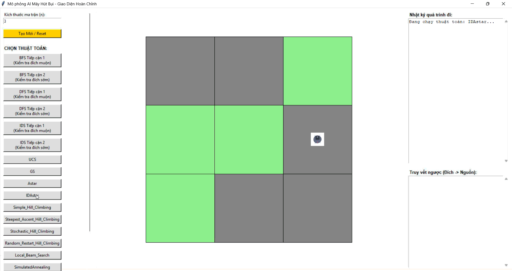

# 📌 Introduction to Artificial Intelligence  - AI vacuum cleaner project & visual interface

---

## 👤 Thông tin sinh viên
- **Họ và tên:** Nguyễn Xuân Nhật
- **Mã số sinh viên (MSSV):** 24110293
- **Môn học:** Introduction to AI (Nhập môn Trí tuệ Nhân tạo)

---

## 📌 Tổng quan dự án
Dự án này lưu trữ toàn bộ các bài tập thực hành, đồ án và mã nguồn được xây dựng cho môn học **Nhập môn Trí tuệ Nhân tạo (Introduction to AI)**. 

Dự án bao gồm:
1. **Tác nhân phản xạ (Reflex Agents):** Các mô hình tác nhân phản xạ đơn giản và tác nhân có mô hình bộ nhớ giải quyết bài toán robot hút bụi và 8-puzzle.
2. **Trực quan hóa Thuật toán Tìm kiếm (Search Algorithms Visualizer):** Giao diện đồ họa viết bằng thư viện **Tkinter (Python)** minh họa hoạt động của hơn 15 thuật toán tìm kiếm trên bản đồ robot hút bụi (từ tìm kiếm mù, tìm kiếm heuristic đến tìm kiếm cục bộ và tìm kiếm trong môi trường phức tạp).
3. **Đồ án Tô màu bản đồ (CSP - Constraint Satisfaction Problems):** Trực quan hóa và giải quyết bài toán tô màu bản đồ sử dụng các thuật toán thỏa mãn ràng buộc tối ưu như AC-3, Backtracking, Forward Checking, và Min-Conflicts.
4. **Đồ án Tic-Tac-Toe (Adversarial Search):** Trò chơi Tic-Tac-Toe đối kháng trực quan hóa và kiểm thử hoạt động của các thuật toán tìm kiếm đối kháng kinh điển.

---

## 📂 Cấu trúc thư mục dự án
```text
trí tuệ nhân tạo/
├── simple reflex agent/             # Các mô hình Agent phản xạ đơn giản
│   └── 8puzzle                      # File giải bài toán 8-Puzzle bằng Agent phản xạ
├── map_cloring/                     # Đồ án Tô màu bản đồ (Constraint Satisfaction Problems)
│   ├── algorithms/                  # Thuật toán giải CSP
│   │   ├── AC3.py                   # Thuật toán Arc Consistency 3
│   │   ├── back_tracking.py         # Thuật toán Quay lui Backtracking
│   │   ├── forward_checking.py      # Thuật toán Kiểm tra trước Forward Checking
│   │   └── min_conflicts.py         # Thuật toán Cực tiểu hóa xung đột Min-Conflicts
│   └── main_ui.py                   # Giao diện chính đồ án Tô màu bản đồ (Tkinter)
├── tic_tac_toe/                     # Trò chơi Tic-Tac-Toe đối kháng (Adversarial Search)
│   ├── algorithms/                  # Thuật toán tìm kiếm đối kháng
│   │   ├── alpha_beta.py            # Giải thuật Alpha-Beta Pruning
│   │   ├── expectimax.py            # Giải thuật Expectimax
│   │   └── minimax.py               # Giải thuật Minimax
│   └── main_ui.py                   # Giao diện chính game Tic-Tac-Toe (Tkinter)
├── vacuum_project/                  # Đồ án Robot hút bụi thông minh (Search Algorithms & GUI)
│   ├── algorithms/                  # Thuật toán tìm kiếm cốt lõi
│   │   ├── And_Or_Search.py         # Tìm kiếm đồ thị AND-OR
│   │   ├── Astar.py                 # Tìm kiếm A*
│   │   ├── BFS_1.py                 # BFS tiếp cận 1 (Đích muộn)
│   │   ├── BFS_2.py                 # BFS tiếp cận 2 (Đích sớm)
│   │   ├── DFS_1.py                 # DFS tiếp cận 1 (Đích muộn)
│   │   ├── DFS_2.py                 # DFS tiếp cận 2 (Đích sớm)
│   │   ├── DFS_Searching_With_No_Observation.py          # Tìm kiếm không cảm biến (Sensorless)
│   │   ├── DFS_Searching_for_partially_observable_problems.py # Tìm kiếm quan sát bộ phận
│   │   ├── GS.py                    # Greedy Best-First Search
│   │   ├── IDAstar.py               # Tìm kiếm IDA*
│   │   ├── IDS_1.py                 # IDS tiếp cận 1 (Đích muộn)
│   │   ├── IDS_2.py                 # IDS tiếp cận 2 (Đích sớm)
│   │   ├── Local_Beam_Search.py     # Tìm kiếm chùm tia cục bộ
│   │   ├── Random_Restart_Hill_Climbing.py               # Leo đồi khởi động lại ngẫu nhiên
│   │   ├── Simple_Hill_Climbing.py  # Leo đồi đơn giản
│   │   ├── Simulated_Annealing.py   # Luyện kim giả lập
│   │   ├── Steepest_Ascent_Hill_Climbing.py              # Leo đồi dốc nhất
│   │   ├── Stochastic_Hill_Climbing.py                   # Leo đồi ngẫu nhiên
│   │   └── UCS.py                   # Tìm kiếm chi phí đồng nhất Uniform Cost
│   ├── visualizer/                  # Giao diện đồ họa (GUI) trực quan hóa Robot hút bụi
│   │   ├── main_UI.ipynb            # Notebook thử nghiệm giao diện
│   │   ├── matrix.txt               # Bản đồ ma trận đầu vào mặc định
│   │   ├── test_main.py             # File chạy giao diện Tkinter chính
│   │   └── vacuum.png               # Asset ảnh của robot hút bụi
│   └── node.py                      # Lớp định nghĩa cấu trúc nút (Node) tìm kiếm
├── gift/                            # Thư mục chứa ảnh GIF trực quan hóa thuật toán
├── 8puzzle.ipynb                    # Notebook thực hành 8-Puzzle
├── mayhutbui.ipynb                  # Notebook thực hành Robot hút bụi cơ bản
└── README.md                        # Tài liệu giới thiệu dự án (File này)
```

---

## Phần 1: Tác nhân Phản xạ (Reflex Agents)

### 1. Simple Reflex Agent (Tác nhân phản xạ đơn giản)
Tác nhân phản xạ đơn giản hoạt động dựa trên các quy tắc Điều kiện - Hành động (Condition-Action Rules). Tác nhân này đưa ra quyết định hành động tại mỗi thời điểm chỉ dựa trên những cảm nhận hiện tại từ môi trường mà không quan tâm đến lịch sử hành động hay trạng thái trước đó. Nó hoạt động tốt nhất trong các môi trường hoàn toàn có thể quan sát được (fully observable).

### 2. Model-Based Reflex Agent (Tác nhân phản xạ dựa trên mô hình)
Tác nhân phản xạ dựa trên mô hình duy trì một trạng thái bên trong (internal state) để theo dõi các phần không thể quan sát được của môi trường hiện tại. Trạng thái bên trong này được cập nhật liên tục dựa trên các cảm nhận mới và mô hình hoạt động của thế giới (cách thế giới vận hành độc lập và ảnh hưởng của hành động của chính tác nhân lên thế giới). Nhờ có mô hình bộ nhớ này, tác nhân có thể hoạt động tốt trong các môi trường quan sát được một phần (partially observable).

---

## Phần 2: Phân loại và Chi tiết 6 nhóm thuật toán lớn

---

### Nhóm 1: Tìm kiếm không có thông tin (Uninformed Search)
Các thuật toán tìm kiếm không có thông tin (hay tìm kiếm mù) duyệt qua không gian trạng thái một cách hệ thống mà không có thêm bất kỳ chỉ dẫn hay ước lượng nào về khoảng cách đến đích, ngoại trừ định nghĩa của bài toán.

#### 1. BFS (Breadth-First Search - Tìm kiếm theo chiều rộng)
* **Mã giả (Pseudo-code):**
  ```python
  def BFS(problem):
      node = Node(state=problem.initial_state)
      if problem.is_goal(node.state): return node
      frontier = Queue([node]) # Hàng đợi FIFO (First In First Out)
      explored = Set()
      while not frontier.is_empty():
          node = frontier.pop()
          explored.add(node.state)
          for action in problem.actions(node.state):
              child = child_node(problem, node, action)
              if child.state not in explored and child.state not in frontier:
                  if problem.is_goal(child.state): return child
                  frontier.push(child)
      return None
  ```
* **Minh họa hoạt động:**
  
  

#### 2. DFS (Depth-First Search - Tìm kiếm theo chiều sâu)
* **Mã giả (Pseudo-code):**
  ```python
  def DFS(problem):
      frontier = Stack([Node(state=problem.initial_state)]) # Ngăn xếp LIFO (Last In First Out)
      explored = Set()
      while not frontier.is_empty():
          node = frontier.pop()
          if problem.is_goal(node.state): return node
          if node.state not in explored:
              explored.add(node.state)
              for action in problem.actions(node.state):
                  frontier.push(child_node(problem, node, action))
      return None
  ```
* **Minh họa hoạt động:**
  
  

#### 3. IDS (Iterative Deepening Search - Tìm kiếm sâu dần)
* **Mã giả (Pseudo-code):**
  ```python
  def IDS(problem):
      for depth in range(0, infinity):
          result = Depth_Limited_Search(problem, depth)
          if result != cutoff: return result

  def Depth_Limited_Search(problem, limit):
      return Recursive_DLS(Node(problem.initial_state), problem, limit)

  def Recursive_DLS(node, problem, limit):
      if problem.is_goal(node.state): return node
      elif limit == 0: return cutoff
      else:
          cutoff_occurred = False
          for action in problem.actions(node.state):
              child = child_node(problem, node, action)
              result = Recursive_DLS(child, problem, limit - 1)
              if result == cutoff: cutoff_occurred = True
              elif result is not None: return result
          return cutoff if cutoff_occurred else None
  ```
* **Minh họa hoạt động:**
  
  

#### 4. UCS (Uniform Cost Search - Tìm kiếm chi phí đồng nhất)
* **Mã giả (Pseudo-code):**
  ```python
  def UCS(problem):
      node = Node(state=problem.initial_state)
      frontier = PriorityQueue(node, key=lambda n: n.path_cost) # Hàng đợi ưu tiên Min
      explored = Set()
      while not frontier.is_empty():
          node = frontier.pop()
          if problem.is_goal(node.state): return node
          explored.add(node.state)
          for action in problem.actions(node.state):
              child = child_node(problem, node, action)
              if child.state not in explored and child.state not in frontier:
                  frontier.push(child)
              elif child.state in frontier với chi phí cao hơn:
                  thay thế nút trong frontier bằng child
      return None
  ```
* **Minh họa hoạt động:**
  

---

### Nhóm 2: Tìm kiếm có thông tin (Informed / Heuristic Search)
Các thuật toán sử dụng tri thức bổ sung dưới dạng hàm heuristic $h(n)$ để ước lượng khoảng cách từ trạng thái hiện tại đến đích nhằm tăng tốc độ tìm kiếm.

#### 1. Greedy Best-First Search (Tìm kiếm tham lam tốt nhất)
* **Mã giả (Pseudo-code):**
  ```python
  def Greedy_Best_First(problem):
      node = Node(state=problem.initial_state)
      frontier = PriorityQueue(node, key=lambda n: heuristic(n.state))
      explored = Set()
      while not frontier.is_empty():
          node = frontier.pop()
          if problem.is_goal(node.state): return node
          explored.add(node.state)
          for action in problem.actions(node.state):
              child = child_node(problem, node, action)
              if child.state not in explored and child.state not in frontier:
                  frontier.push(child)
      return None
  ```
* **Minh họa hoạt động:**
  

#### 2. A\* Search (Tìm kiếm A-sao)
* **Mã giả (Pseudo-code):**
  ```python
  def A_Star(problem):
      node = Node(state=problem.initial_state)
      frontier = PriorityQueue(node, key=lambda n: n.path_cost + heuristic(n.state))
      explored = Set()
      while not frontier.is_empty():
          node = frontier.pop()
          if problem.is_goal(node.state): return node
          explored.add(node.state)
          for action in problem.actions(node.state):
              child = child_node(problem, node, action)
              if child.state not in explored and child.state not in frontier:
                  frontier.push(child)
              elif child.state in frontier với f(n) lớn hơn:
                  thay thế nút trong frontier bằng child
      return None
  ```
* **Minh họa hoạt động:**
  

#### 3. IDA\* (Iterative Deepening A\* - Tìm kiếm A-sao sâu dần)
* **Mã giả (Pseudo-code):**
  ```python
  def IDA_Star(problem):
      limit = heuristic(problem.initial_state)
      while True:
          temp_limit, result = DLS_A_Star(problem.initial_state, 0, limit)
          if result == goal: return result
          if temp_limit == infinity: return None
          limit = temp_limit

  def DLS_A_Star(state, g_cost, limit):
      f_cost = g_cost + heuristic(state)
      if f_cost > limit: return f_cost, None
      if is_goal(state): return limit, state
      min_limit = infinity
      for action in actions(state):
          next_state = transition(state, action)
          temp_limit, result = DLS_A_Star(next_state, g_cost + step_cost, limit)
          if result is not None: return limit, result
          if temp_limit < min_limit: min_limit = temp_limit
      return min_limit, None
  ```
* **Minh họa hoạt động:**
  

---

### Nhóm 3: Tìm kiếm cục bộ (Local Search)
Tập trung vào việc cải thiện trạng thái hiện tại thay vì ghi nhớ toàn bộ đường đi từ nguồn. Cực kỳ thích hợp cho các bài toán tối ưu hóa.

#### 1. Simple Hill Climbing (Leo đồi đơn giản)
* **Mã giả (Pseudo-code):**
  ```python
  def Simple_Hill_Climbing(problem):
      current = problem.initial_state
      while True:
          neighbors = problem.neighbors(current)
          found_better = False
          for neighbor in neighbors:
              if value(neighbor) > value(current):
                  current = neighbor
                  found_better = True
                  break # Chọn ngay lân cận tốt hơn đầu tiên tìm thấy
          if not found_better:
              return current
  ```
* **Minh họa hoạt động:**
  

#### 2. Steepest Ascent Hill Climbing (Leo đồi dốc nhất)
* **Mã giả (Pseudo-code):**
  ```python
  def Steepest_Ascent_Hill_Climbing(problem):
      current = problem.initial_state
      while True:
          neighbors = problem.neighbors(current)
          best_neighbor = None
          best_val = value(current)
          for neighbor in neighbors:
              val = value(neighbor)
              if val > best_val:
                  best_val = val
                  best_neighbor = neighbor
          if best_neighbor is None:
              return current # Đạt cực đại cục bộ
          current = best_neighbor
  ```
* **Minh họa hoạt động:**
  *(Không có file ảnh động minh họa cho biến thể này)*

#### 3. Stochastic Hill Climbing (Leo đồi ngẫu nhiên)
* **Mã giả (Pseudo-code):**
  ```python
  def Stochastic_Hill_Climbing(problem):
      current = problem.initial_state
      while True:
          neighbors = problem.neighbors(current)
          better_neighbors = []
          for neighbor in neighbors:
              if value(neighbor) > value(current):
                  better_neighbors.append(neighbor)
          if not better_neighbors:
              return current # Không tìm thấy trạng thái nào tốt hơn
          current = random_select(better_neighbors) # Chọn ngẫu nhiên trong số các lân cận tốt hơn
  ```
* **Minh họa hoạt động:**
  

#### 4. Random Restart Hill Climbing (Leo đồi khởi động lại ngẫu nhiên)
* **Mã giả (Pseudo-code):**
  ```python
  def Random_Restart_Hill_Climbing(problem, max_restarts):
      best_solution = None
      best_value = float('-inf')
      for i in range(max_restarts):
          if i == 0:
              state = problem.initial_state
          else:
              state = generate_random_state(problem)
          solution = Hill_Climbing(state)
          if value(solution) > best_value:
              best_value = value(solution)
              best_solution = solution
              if problem.is_goal(best_solution):
                  return best_solution
      return best_solution
  ```
* **Minh họa hoạt động:**
  

#### 5. Local Beam Search (Tìm kiếm chùm tia cục bộ - Beam Search)
* **Mã giả (Pseudo-code):**
  ```python
  def Local_Beam_Search(problem, k):
      frontier = [problem.initial_state for _ in range(k)] # Lưu trữ song song k trạng thái
      while True:
          candidates = []
          for state in frontier:
              candidates.extend(problem.neighbors(state))
          frontier = select_best_k(candidates, k) # Giữ lại k trạng thái tốt nhất
          if any(problem.is_goal(state) for state in frontier):
              return get_goal_state(frontier)
  ```
* **Minh họa hoạt động:**
  

#### 6. Simulated Annealing (Luyện kim giả lập)
* **Mã giả (Pseudo-code):**
  ```python
  def Simulated_Annealing(problem, schedule):
      current = problem.initial_state
      for t in range(1, infinity):
          T = schedule(t) # Nhiệt độ giảm dần
          if T == 0: return current
          next_state = random_select(problem.neighbors(current))
          delta_E = value(next_state) - value(current)
          if delta_E > 0:
              current = next_state
          else:
              current = next_state với xác suất e^(delta_E / T)
  ```
* **Minh họa hoạt động:**
  

---

### Nhóm 4: Tìm kiếm trong môi trường phức tạp (Search in Complex Environments - Bán quan sát/Không cảm biến)
Tìm kiếm khi môi trường không còn tính xác định (nondeterministic) hoặc không thể quan sát đầy đủ (partially observable).

#### 1. Sensorless Search (Tìm kiếm không cảm biến - Mù hoàn toàn)
* **Mã giả (Pseudo-code):**
  ```python
  def Sensorless_Search_DFS(problem):
      # Khởi tạo trạng thái niềm tin (Belief State) chứa các trạng thái khả dĩ
      start_belief = problem.initial_belief_state
      frontier = Stack([Belief_Node(start_belief)])
      reached = Set()
      while not frontier.is_empty():
          curr_belief = frontier.pop()
          # Đích đạt được khi toàn bộ các trạng thái khả dĩ trong niềm tin đều đạt đích
          if curr_belief.is_goal(): 
              return curr_belief
          state_key = curr_belief.get_state_key()
          if state_key not in reached:
              reached.add(state_key)
              for action in problem.actions:
                  # Dự đoán trạng thái niềm tin mới mà không có cảm nhận cảm biến
                  next_belief = predict_belief(curr_belief, action)
                  frontier.push(Belief_Node(next_belief, parent=curr_belief, action=action))
      return None
  ```
* **Minh họa hoạt động:**
  

#### 2. Partial Observation Search (Tìm kiếm quan sát bộ phận - Mù một phần)
* **Mã giả (Pseudo-code):**
  ```python
  def Partially_Observable_Search(problem):
      start_belief = problem.initial_belief_state
      frontier = Stack([Belief_Node(start_belief)])
      reached = Set()
      while not frontier.is_empty():
          curr_belief = frontier.pop()
          if curr_belief.is_goal():
              return curr_belief
          state_key = curr_belief.get_state_key()
          if state_key not in reached:
              reached.add(state_key)
              for action in problem.actions:
                  # Bước dự đoán (Predict step)
                  predicted_belief = predict_belief(curr_belief, action)
                  # Bước cập nhật (Update step) dựa trên cảm nhận cảm biến thu được
                  for percept in problem.percepts(predicted_belief):
                      next_belief = update_belief(predicted_belief, percept)
                      frontier.push(Belief_Node(next_belief, parent=curr_belief, action=action))
      return None
  ```
* **Minh họa hoạt động:**
  

#### 3. And-Or Graph Search (Tìm kiếm đồ thị AND-OR)
* **Mã giả (Pseudo-code):**
  ```python
  def And_Or_Graph_Search(problem):
      return Or_Search(problem.initial_state, problem, [])

  def Or_Search(state, problem, path):
      if problem.is_goal(state): return empty_plan
      if state in path: return failure
      for action in problem.actions(state):
          plan = And_Search(Results(state, action), problem, [state] + path)
          if plan != failure: return [action, plan]
      return failure

  def And_Search(states, problem, path):
      plan = {}
      for s in states:
          p = Or_Search(s, problem, path)
          if p == failure: return failure
          plan[s] = p
      return plan
  ```
* **Minh họa hoạt động:**
  *(Không có file ảnh động minh họa cho thuật toán này)*

---

### Nhóm 5: Bài toán thỏa mãn ràng buộc (CSP - Constraint Satisfaction Problems)
Giải quyết bài toán bằng cách phân bổ giá trị cho các biến sao cho thỏa mãn tập các ràng buộc đặt ra.

#### 1. Backtracking Search (Tìm kiếm quay lui)
* **Mã giả (Pseudo-code):**
  ```python
  def Backtracking_Search(csp):
      return Backtrack({}, csp)

  def Backtrack(assignment, csp):
      if is_complete(assignment, csp): return assignment
      var = select_unassigned_variable(assignment, csp)
      for value in order_domain_values(var, assignment, csp):
          if is_consistent(var, value, assignment, csp):
              assignment.add(var, value)
              result = Backtrack(assignment, csp)
              if result != failure: return result
              assignment.remove(var, value)
      return failure
  ```
* **Minh họa hoạt động:**
  

#### 2. Forward Checking (Kiểm tra trước)
* **Mã giả (Pseudo-code):**
  ```python
  def Forward_Checking(assignment, csp, var, value):
      assignment.add(var, value)
      for neighbor in csp.neighbors(var):
          if neighbor not in assignment:
              remove value from neighbor.domain if it violates constraints
              if neighbor.domain is empty: return failure
      return success
  ```
* **Minh họa hoạt động:**
  

#### 3. AC-3 (Arc Consistency 3 - Nhất quán cung)
* **Mã giả (Pseudo-code):**
  ```python
  def AC_3(csp):
      queue = Queue(all_arcs_in_csp)
      while not queue.is_empty():
          (Xi, Xj) = queue.pop()
          if Revise(csp, Xi, Xj):
              if len(Xi.domain) == 0: return False
              for Xk in csp.neighbors(Xi) - {Xj}:
                  queue.push((Xk, Xi))
      return True

  def Revise(csp, Xi, Xj):
      revised = False
      for x in Xi.domain:
          if no y in Xj.domain satisfies constraint between Xi and Xj:
              remove x from Xi.domain
              revised = True
      return revised
  ```
* **Minh họa hoạt động:**
  

#### 4. Min-Conflicts (Cực tiểu hóa xung đột)
* **Mã giả (Pseudo-code):**
  ```python
  def Min_Conflicts(csp, max_steps):
      current = complete_random_assignment(csp)
      for i in range(max_steps):
          if is_solution(current, csp): return current
          var = random_select(conflicted_variables(current, csp))
          value = argmin(csp.domain(var), key=lambda val: conflicts(var, val, current, csp))
          current[var] = value
      return failure
  ```
* **Minh họa hoạt động:**
  

---

### Nhóm 6: Tìm kiếm đối kháng (Adversarial Search)
Được sử dụng trong các môi trường trò chơi có tính cạnh tranh giữa nhiều người chơi (như trò chơi Tic-Tac-Toe, Cờ vua, Cờ tướng) khi hành động của một bên nhằm mục đích tối thiểu hóa cơ hội thắng của đối thủ.

#### 1. Minimax
* **Mã giả (Pseudo-code):**
  ```python
  def Minimax_Decision(state):
      # Trả về hành động mang lại giá trị tối ưu cho Maximizer
      return argmax(actions(state), key=lambda a: Min_Value(Result(state, a)))

  def Max_Value(state):
      if Terminal_Test(state): return Utility(state)
      v = float('-inf')
      for action in actions(state):
          v = max(v, Min_Value(Result(state, action)))
      return v

  def Min_Value(state):
      if Terminal_Test(state): return Utility(state)
      v = float('inf')
      for action in actions(state):
          v = min(v, Max_Value(Result(state, action)))
      return v
  ```
* **Minh họa hoạt động:**
  

#### 2. Alpha-Beta Pruning (Cắt tỉa Alpha-Beta)
* **Mã giả (Pseudo-code):**
  ```python
  def Alpha_Beta_Search(state):
      # Trả về hành động tối ưu sử dụng các ngưỡng alpha và beta để cắt tỉa nhánh
      return argmax(actions(state), key=lambda a: Min_Value(Result(state, a), float('-inf'), float('inf')))

  def Max_Value(state, alpha, beta):
      if Terminal_Test(state): return Utility(state)
      v = float('-inf')
      for action in actions(state):
          v = max(v, Min_Value(Result(state, action), alpha, beta))
          if v >= beta: return v # Cắt nhánh Min
          alpha = max(alpha, v)
      return v

  def Min_Value(state, alpha, beta):
      if Terminal_Test(state): return Utility(state)
      v = float('inf')
      for action in actions(state):
          v = min(v, Max_Value(Result(state, action), alpha, beta))
          if v <= alpha: return v # Cắt nhánh Max
          beta = min(beta, v)
      return v
  ```
* **Minh họa hoạt động:**
  

#### 3. Expectimax
* **Mã giả (Pseudo-code):**
  ```python
  def Expectimax(state, depth, is_maximizing):
      if Terminal_Test(state): return Utility(state)
      
      if is_maximizing:
          v = float('-inf')
          for action in actions(state):
              v = max(v, Expectimax(Result(state, action), depth + 1, False))
          return v
      else:
          # Thay vì chọn nước đi có giá trị nhỏ nhất (Min), ta tính giá trị kỳ vọng (Expected Value)
          # với giả định đối thủ chọn nước đi ngẫu nhiên với xác suất đồng đều.
          total_value = 0
          possible_actions = actions(state)
          for action in possible_actions:
              total_value += Expectimax(Result(state, action), depth + 1, True)
          return total_value / len(possible_actions) if possible_actions else 0
  ```
* **Minh họa hoạt động:**
  

---

## 🚀 Hướng dẫn chạy chương trình

### 🧹 1. Ứng dụng mô phỏng Robot hút bụi (vacuum_project)
Để khởi chạy ứng dụng trực quan hóa robot hút bụi bằng Tkinter:

1. Di chuyển vào thư mục dự án:
   ```bash
   cd "vacuum_project/visualizer"
   ```
2. Chạy ứng dụng Python:
   ```bash
   python test_main.py
   ```
3. **Các tính năng trên giao diện:**
   - Chọn thuật toán tìm kiếm từ thanh menu bên trái (BFS, DFS, IDS, UCS, A*, v.v.).
   - Nhấn nút **Tạo Mới / Reset** để làm mới bản đồ dựa theo file cấu hình ma trận `matrix.txt`.
   - Xem nhật ký di chuyển thời gian thực bên phải và quá trình truy vết ngược sau khi hoàn tất.

### 🎨 2. Ứng dụng tô màu bản đồ (map_cloring)
Để chạy chương trình trực quan hóa bài toán CSP tô màu bản đồ:

1. Di chuyển vào thư mục tô màu bản đồ:
   ```bash
   cd "map_cloring"
   ```
2. Chạy file giao diện chính:
   ```bash
   python main_ui.py
   ```
3. **Các tính năng:**
   - Chọn các thuật toán CSP (Backtracking, Forward Checking, Min-Conflicts, AC-3) để xem cách phân bổ màu sắc cho các tỉnh/bang sao cho không có 2 vùng kề nhau trùng màu.

### 🎮 3. Trò chơi Tic-Tac-Toe đối kháng (tic_tac_toe)
Để khởi chạy trò chơi Tic-Tac-Toe đối kháng với AI sử dụng thuật toán tìm kiếm đối kháng:

1. Di chuyển vào thư mục Tic-Tac-Toe:
   ```bash
   cd "tic_tac_toe"
   ```
2. Chạy ứng dụng Python:
   ```bash
   python main_ui.py
   ```
3. **Các tính năng:**
   - Chọn thuật toán đối kháng cho AI (Minimax, Alpha-Beta Pruning, Expectimax).
   - Đấu trực tiếp với AI và theo dõi số trạng thái đã duyệt (States Explored) cũng như điểm số đánh giá nước đi của AI theo thời gian thực.
